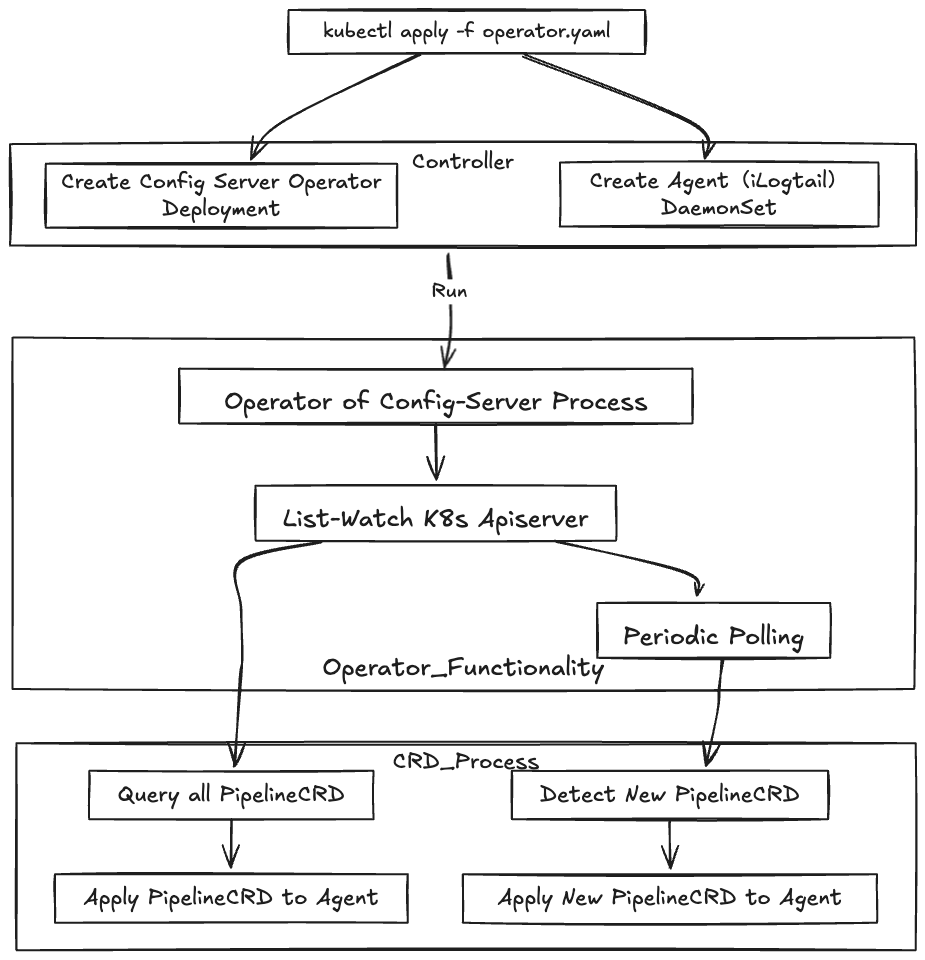

# LoongCollector Operator

LoongCollector Operator 是一个 Kubernetes Operator，用于管理 iLogtail 的 Pipeline 配置。它通过监听 Pipeline CRD 的变化，自动将配置应用到 iLogtail Agent。

## 架构



## 功能特性

- 支持通过 Kubernetes CRD 管理 iLogtail Pipeline 配置
- 自动将 Pipeline 配置同步到 iLogtail Agent
- 支持配置验证和错误处理
- 支持配置重试机制
- 支持优雅删除和资源清理
- 支持通过 ConfigMap 配置 Config-Server 地址

## 安装

### 前提条件

- Kubernetes 集群 1.16+
- iLogtail 已部署并运行
- Config-Server 已部署并运行

### 部署 Operator

1. 安装 CRD：

```bash
kubectl apply -f config/crd/bases/infraflow_v1_pipelines.yaml
```

2. 部署 Operator：

```bash
kubectl apply -f config/manager/manager.yaml
```

3. 创建 Config-Server 配置（可选）：

```bash
kubectl apply -f config/samples/config-server-config.yaml
```

## 使用

### 创建 Pipeline

创建一个示例 Pipeline：

```yaml
apiVersion: infraflow.co/v1
kind: Pipeline
metadata:
  name: sample-pipeline
spec:
  name: sample-pipeline
  content: |
    inputs:
      - type: file
        path: /var/log/containers/*.log
    processors:
      - type: json
        fields:
          - message
    outputs:
      - type: stdout
```

应用配置：

```bash
kubectl apply -f config/samples/pipeline.yaml
```

### 配置说明

#### Pipeline CRD

Pipeline CRD 定义了以下字段：

- `spec.name`: Pipeline 名称
- `spec.config`: Pipeline 配置（YAML 格式）

#### Config-Server 配置

可以通过 ConfigMap 配置 Config-Server 地址：

```yaml
apiVersion: v1
kind: ConfigMap
metadata:
  name: config-server-config
  namespace: loongcollector-system
data:
  configServerURL: "http://config-server:8899"  # 默认值
```

## 开发

### 本地开发

1. 安装依赖：

```bash
go mod tidy
```

2. 运行测试：

```bash
make test
```

3. 构建镜像：

```bash
make docker-build
```

### 项目结构

```
.
├── api/                    # API 定义
│   └── v1/                # v1 API
├── config/                # 配置文件
│   ├── crd/              # CRD 定义
│   ├── manager/          # 管理器配置
│   └── samples/          # 示例配置
├── controllers/          # 控制器
├── internal/            # 内部包
│   ├── controller/      # 控制器实现
│   └── pkg/            # 工具包
└── main.go             # 入口文件
```

## 许可证

[Apache License 2.0](LICENSE)